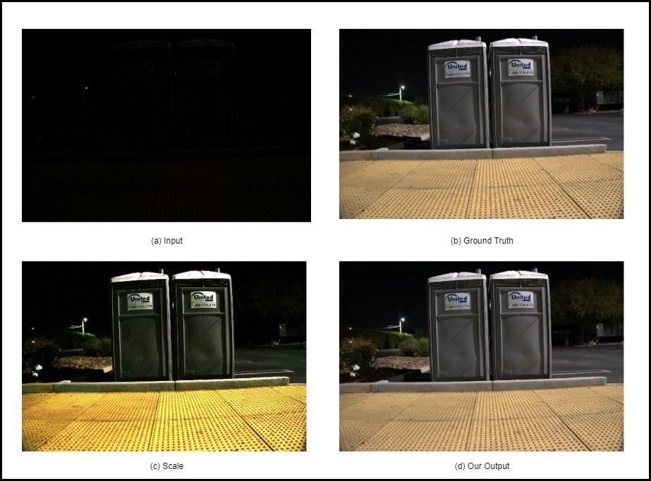
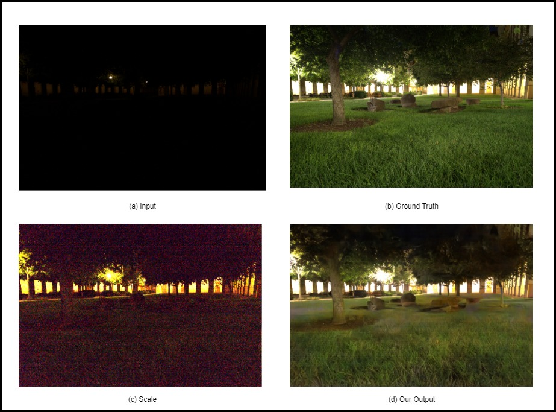

<h1 align="center"><b> SeeInDark 🔆✨ </b></h1>

<h2><b>Learning to See in the Dark using pytorch</b></h2>
<br></br>
<p align="center"></p>
<p align="center"></p>

## Requirements
- 64 GB RAM
- GTX 1080
- PyTorch 0.4.0
- RawPy 0.10
- Scipy

The program have been tested on Ubuntu 16.04 and Windows 10.

## Download Dataset
Execute:
```python
python download_dataset.py
```

## Download Dependancies
```bash
pip install rawpy
pip install torch===1.4.0 torchvision===0.5.0 -f https://download.pytorch.org/whl/torch_stable.html
pip install scipy
```

## Training
```python
python train.py
```
- It will save model and generate result images every 100 epochs. 
- The trained models will be saved in `saved_model/` and the result images will be saved in `test_result_Sony/`.
- The result of the current output is displayed on the right side of the image file with the ground truth counter part shown on the left side.

## Testing
```python 
python test.py
```

- The trained model is only for `.ARW` photos taken by Sony cameras.
- Pytorch somehow needs more GPU resources than Tensorflow. Therefore, it is impossible to take in the whole image.
- Testing will only take 1024 * 1024 pixels from the test images. 
- This testing script is only for checking the performance of the trained model.
- The result will be saved in `test_result_Sony` with `gt` as ground truth images, `scale` as scaled images, `ori` as input images, and `out` as output images.
